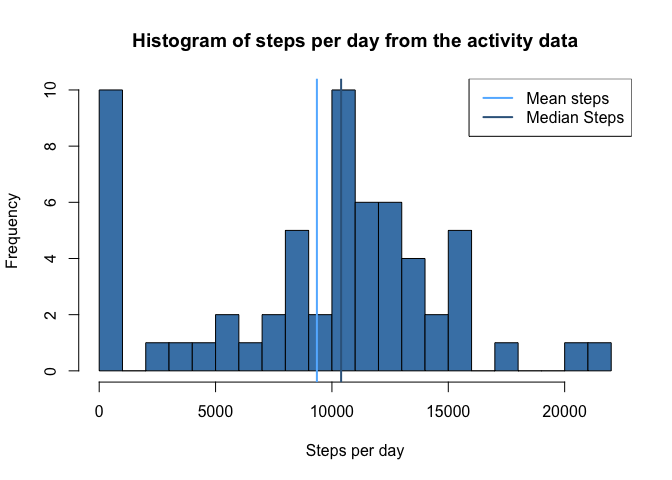
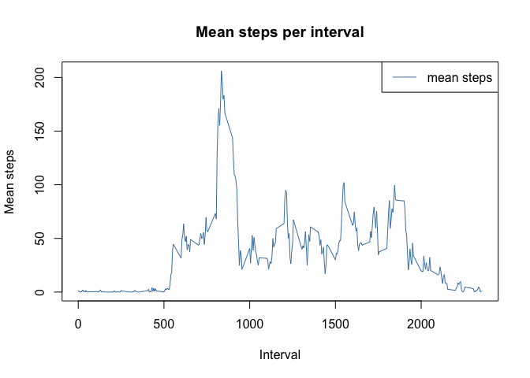
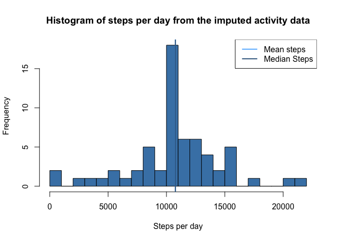
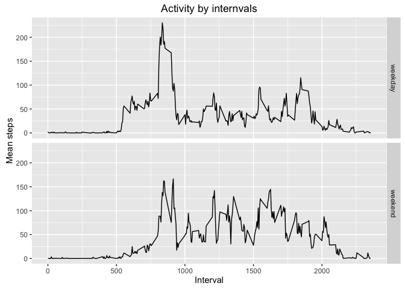

# Reproducible Research: Peer Assessment 1

It is now possible to collect a large amount of data about personal
movement using activity monitoring devices such as a
[Fitbit](http://www.fitbit.com),
[Nike Fuelband](http://www.nike.com/us/en_us/c/nikeplus-fuelband), or
[Jawbone Up](https://jawbone.com/up). These type of devices are part of
the "quantified self" movement -- a group of enthusiasts who take
measurements about themselves regularly to improve their health, to
find patterns in their behavior, or because they are tech geeks. But
these data remain under-utilized both because the raw data are hard to
obtain and there is a lack of statistical methods and software for
processing and interpreting the data.

In this assignment we make use of provided data from a personal activity
monitoring device. This device collects data at 5 minute intervals
through out the day. The data consists of two months of data from
an anonymous individual collected during the months of October
and November, 2012 and include the number of steps taken in 5
minute intervals each day.

Before we start, we set some global options that will show the R code
embedded into the document, rather than the default of not displaying
it. We also take this opportunity to load some R libraries that will
be required, and not the warnings that loading these packages will
generate.


```r
library(knitr)
```

```
## Warning: package 'knitr' was built under R version 3.2.3
```

```r
opts_chunk$set(echo=TRUE)

library(dplyr)
```

```
## Warning: package 'dplyr' was built under R version 3.2.2
```

```
## 
## Attaching package: 'dplyr'
```

```
## The following objects are masked from 'package:stats':
## 
##     filter, lag
```

```
## The following objects are masked from 'package:base':
## 
##     intersect, setdiff, setequal, union
```

```r
library(ggplot2)
```

```
## Warning: package 'ggplot2' was built under R version 3.2.3
```
This means we do not need to rely on remembering to set this for each
chunk. The data should be provided in this Github repository, however
for completeness we check this and if it is missing download it from
the course website


```r
activityDataURL <- 'https://d396qusza40orc.cloudfront.net/repdata%2Fdata%2Factivity.zip'
dataZipFile <- 'activity.zip'

if ( ! file.exists(dataZipFile) ) {
    download.file(activityDataURL, destfile='activity.zip', method='curl')
}
```

## Loading and preprocessing the data

Before embarking on the analysis, we need to uncompress the zip file,
load the data into R. We create directory `data` to store the
uncompressed data in and always overwrite the data in this directory
(to be sure we have a valid unedited copy of the data).


```r
dataDirectory <- './data'
if ( ! file.exists( dataDirectory ) ) {
    dir.create( dataDirectory )
}
unzip(dataZipFile, exdir=dataDirectory, overwrite=TRUE)
```

We now load this comma separated file, which has a header, into R


```r
activityData <- read.csv( './data/activity.csv',
                          header = TRUE,
                          na.strings = 'NA'
)
```

We pre-process the data to convert the 'date' column from a factor into 
a Data:


```r
activityData$date <- as.Date(activityData$date, '%Y-%m-%d')
```

### What is mean total number of steps taken per day?

We start off by looking at the data, and ignoring any missing values
that are present. Firstly, we group the data and then sum the
number of steps for each day.


```r
activityDay <- activityData  %>%
              group_by( date ) %>%
              summarise_each( funs( sum(., na.rm = TRUE ) ) )

stepsDayMean <- mean(activityDay$steps)
stepsDayMedian <- median(activityDay$steps)
```

We now plot a histogram of the number of steps taken per day, and also
plot lines for the mean steps per day 9354.2295082 and median steps
per day 10395 which we calculated above. We write a
function for the plot, as we will perform a similar plot later on in
this assignment. Given we have 61 variables, we pick (somewhat
arbitrarily) 20 bins.


```r
plot_steps_histogram <- function( data , dataMean, dataMedian, title) {

   hist(data, breaks=20, col = 'steelblue',
       xlab = 'Steps per day', 
       main = title
   )

   # Add lines for the mean and media
   abline(v=dataMean, col='steelblue1', lwd=2)
   abline(v=dataMedian, col='steelblue4', lwd=2)

   # Add a legend
   legend('topright', 
          c('Mean steps', 'Median Steps'),
          col = c('steelblue1', 'steelblue4'),
          lwd = 2 )

}

plot_steps_histogram(activityDay$steps,
                     stepsDayMean, stepsDayMedian,
                     'Histogram of steps per day from the activity data')
```



## What is the average daily activity pattern?

We now focus on the patterns within a day. As with the daily version,
we will ignore any missing values in our calculations. Firstly, we find
the average of steps pre-interval over all the days within the sample
period. 


```r
activityIntervalMean <- activityData  %>%
                    select(interval,steps) %>%
                    group_by( interval ) %>%
                    summarise_each( funs( mean(., na.rm = TRUE ) ) )
```

Now we plot these on a time series plot


```r
plot(activityIntervalMean$interval, activityIntervalMean$steps,
     type='l', col='steelblue',
     xlab='Interval', ylab='Mean steps', main='Mean steps per interval')

legend('topright', col=c('steelblue'), c('mean steps'), lty=1)
```



We now discover in which period, on average across all the days in the
dataset, contains the maximum number of steps. We do this by creating
a new data frame ordered by the mean steps (decreasing, so that the
highest value is first), and then reading off the interval.


```r
activityIntervalMeanSorted <- 
    activityIntervalMean[order(activityIntervalMean$steps, decreasing = TRUE), ]

maxInterval  <- activityIntervalMeanSorted[1,1]
maxMeanSteps <- activityIntervalMeanSorted[1,2]
```
This shows that the ``835`` interval contains that maximum
number  ``206.1698113`` of steps on average across all the days.

## Imputing missing values

We observe from the data file that there are a number of missing values
for steps in our data set. We calculate the total number of rows with
missing values using is.na to return a boolean vector which we sum
(using the fact that TRUE will be cast to 1 and FALSE be cast to 0):


```r
na_values     <-  is.na(activityData$steps)
missingValues <- sum( na_values )
missingValues
```

```
## [1] 2304
```

Thus we see that there are 2304 rows with missing values.

We now impute the missing values in our data set. Our strategy for
this is replace each missing value by the mean value for that 5-minute
interval. This is a straightforwards strategy but seems to be a
reasonable way to achieve this task.

Firstly, we will split out the `activityData` data frame into the 
3 constituent vectors; note that we cast `activitySteps` from an
integer to a numeric value as we will be later using the mean,
which is numeric rather than an integer.


```r
activitySteps    <- as.numeric(activityData$steps)
activityDate     <- activityData$date
activityInterval <- activityData$interval
```

New, we loop over the missing values vector (which we reuse from the
above), and when there is a missing value (i.e. when `na_value[idx]`
is true) we update the `activitySteps` vector with the mean value
for that interval that we calculated above and then compute a check.


```r
for(idx in seq_along(na_values) ) {
   if ( na_values[idx] ) { 
      interval <- activityInterval[idx]
      meanIntervalSteps <-
          activityIntervalMean[activityIntervalMean$interval == interval,]$steps
      activitySteps[idx] <- meanIntervalSteps
   }
}

# Check
newStepsNaSum <- sum( is.na(activitySteps) )
```

After confirming that our check value `newStepsNaSum` = 0 is 
indeed zero as expected, we form a new data frame with the missing values
filled in.


```r
activityDataImputed <- data.frame(steps = activitySteps,
                                  date = activityDate, 
                                  interval = activityInterval )
```

We then (as in part 1 above) plot a histogram of the total number of
steps per day, and calculate the mean and median values:


```r
activityDayImputed <- activityDataImputed  %>%
                      group_by( date ) %>%
                      summarise_each( funs( sum ) ) 

stepsDayImputedMean   <- mean(activityDayImputed$steps)
stepsDayImputedMedian <- median(activityDayImputed$steps)
```

This allows us to plot these values in a histogram:


```r
plot_steps_histogram(activityDayImputed$steps,
               stepsDayImputedMean, stepsDayImputedMedian,
              'Histogram of steps per day from the imputed activity data')
```



We note that filling in the missing values has changed the
the mean from 9354.2295082 to 1.0766189\times 10^{4} (an increase
of 1411.959171).  The median
has also changed from 10395 to 1.0766189\times 10^{4}
(an increase of 371.1886792)

## Are there differences in activity patterns between weekdays and weekends?

We now take the imputed data and use this to try and see if there are
any differences between that activity patterns on weekdays and at
weekends. Firstly, we create a function that will classify a date into
if it is a weekday or a weekend:


```r
assign_weekday_weekend <- function(date) {
    day_of_week <- weekdays(date)
    if ( day_of_week == 'Saturday' | day_of_week == 'Sunday' ) {
        'weekend'
    }
    else {
        'weekday'
    }
}
```

The we use this function to create a new column in our data frame
containing a factor if the date is a weekday or a weekend by applying
the function above to each row of the data frame:


```r
activityDataImputed$weekdayflag <- factor(
    sapply(activityDataImputed$date, assign_weekday_weekend )
)
```

To create a plot comparing activity during the various intervals of
weekdays or weekends, we first take the mean of all activity on
weekdays and weekends:


```r
activityWeekDayEndImputed <- 
   activityDataImputed %>%
   select(interval, weekdayflag, steps) %>%
   group_by(weekdayflag, interval) %>%
   summarise_each( funs( mean ) )
```

We now use ggplot to create a panel plot of to compare each interval
between weekdays and weekends:


```r
weekday_weekend_plot <- ggplot( activityWeekDayEndImputed,
                                aes(interval, steps) ) +
                                geom_line() +
                                facet_grid( weekdayflag ~ .) + 
                                labs(title='Activity by internvals') +
                                xlab('Interval') + ylab('Mean steps')
print(weekday_weekend_plot)
```



